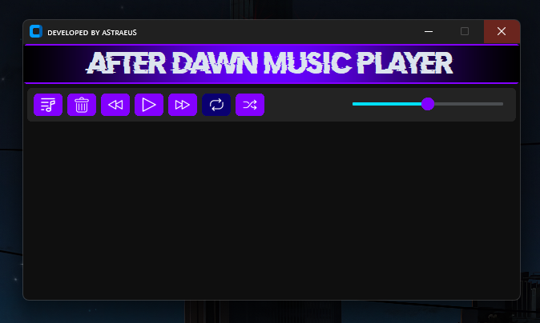

# 🎵 After Dawn Music Player

Um simples player de música desenvolvido enquanto eu (Astraeus) aprendia a criar interfaces gráficas com Python no Windows, utilizando a biblioteca **CustomTkinter**.  
O projeto está em inglês por padrão, e foi feito como um experimento para aprender mais sobre GUI, manipulação de áudio e design visual em Python.

## 🛠 Tecnologias e Bibliotecas Utilizadas

- **Python 1.30.5** (projeto feito em ambiente configurado com essa versão)
- [CustomTkinter](https://github.com/TomSchimansky/CustomTkinter) `==5.2.2` – Interface gráfica moderna e customizável
- [pygame](https://www.pygame.org/) `==2.6.1` – Reproduzir, pausar e manipular faixas de áudio
- [mutagen](https://mutagen.readthedocs.io/) `==1.47.0` – Leitura de metadados de arquivos de áudio (MP3, FLAC, etc)
- [pillow](https://python-pillow.org/) `==11.2.1` – Exibição de imagens e ícones
- [darkdetect](https://pypi.org/project/darkdetect/) `==0.8.0` – Detectar tema claro/escuro do sistema
- [packaging](https://pypi.org/project/packaging/) `==25.0` – Verificação e manipulação de versões e dependências

## 📦 Instalação

Clone o repositório e instale as dependências com:

```bash
pip install -r requirements.txt
```

Ou instale manualmente:

```bash
pip install customtkinter==5.2.2 darkdetect==0.8.0 mutagen==1.47.0 packaging==25.0 pillow==11.2.1 pygame==2.6.1
```

## ▶️ Como usar

Execute o script principal para abrir o player:

```bash
python afterdawn.py
```

Você poderá:

- Tocar e pausar músicas
- Navegar entre faixas
- Ver informações das músicas (metadados)
- Visualizar ícones e interface moderna adaptável ao tema do sistema

## ⚠️ Aviso

> Este projeto foi feito com fins educacionais e **não deve ser comercializado**.  
> O código pode servir como base para estudos ou experimentos pessoais.

## 🔄 Atualizações

Esse projeto já tem algum tempo, mas talvez (bem talvez) eu libere uma nova versão com melhorias visuais e funcionais.

## 👤 Autor

**Astraeus**  
Feito com dedicação durante meus primeiros passos com GUIs em Python.  
Se quiser trocar uma ideia ou ver mais projetos, me chama!

